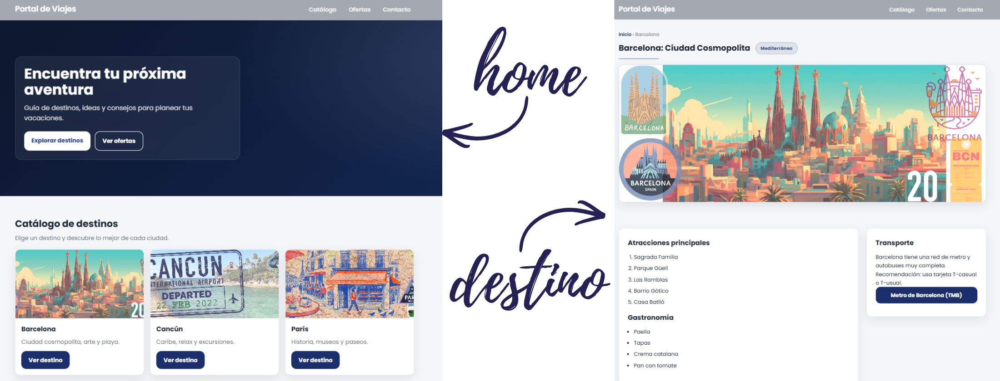

#  Portal de Viajes

Proyecto web estático desarrollado con HTML, CSS y JavaScript enfocado en diseño UI moderno, experiencia de usuario y coherencia visual.

El objetivo del proyecto es crear un portal de destinos con una estética elegante, estructura limpia y microinteracciones profesionales.

---

##  Características principales

- Hero cinematográfico en páginas de destino (formato 16:6)
- Navbar inteligente que:
  - Cambia de estilo al salir del hero
  - Se oculta al bajar
  - Aparece al subir
- Botón flotante "scroll to top"
- Microinteracciones suaves en botones e imágenes
- Animaciones al hacer scroll (IntersectionObserver)
- Layout responsive adaptable a distintos dispositivos
- Estructura limpia sin estilos inline
- Diseño coherente con identidad visual definida

---

##  Tecnologías utilizadas

- HTML5
- CSS3 (Flexbox + Grid + variables CSS)
- JavaScript Vanilla (sin frameworks)
- Google Fonts (Poppins)

---

##  Diseño Responsive

El proyecto está optimizado para:

- Desktop
- Tablet
- Mobile

Se utiliza `grid` y `aspect-ratio` para mantener consistencia visual en todas las resoluciones.

---

##  Enfoque de diseño

El diseño sigue una línea:

- Elegante
- Minimalista estructurado
- Corporativo moderno
- Microinteracciones sutiles
- Jerarquía visual clara

Se priorizó:

- Espaciado consistente
- Tipografía limpia
- Componentes reutilizables
- Separación correcta entre estructura y estilos

---

##  Capturas

---

##  Posibles mejoras futuras

- Transiciones suaves entre páginas
- Modo oscuro
- Filtros dinámicos en el catálogo
- Versión React con componentes reutilizables
- Backend para gestión de destinos

---

##  Autora

Tatiana Baldassarre  
Proyecto desarrollado como práctica de diseño y desarrollo frontend.